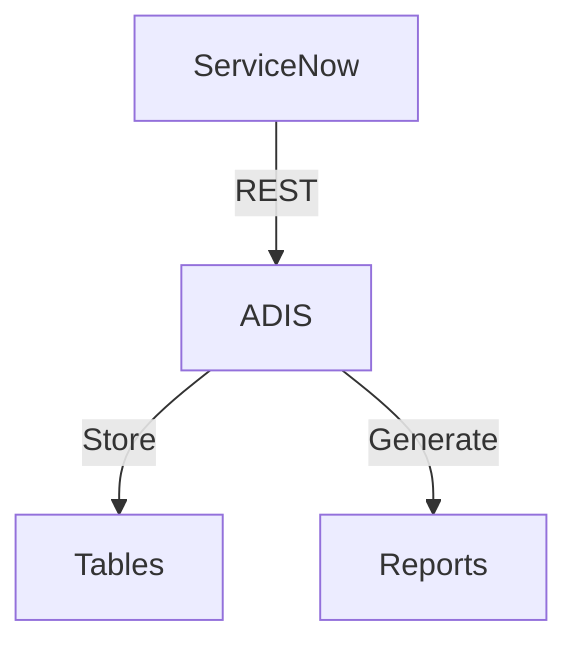
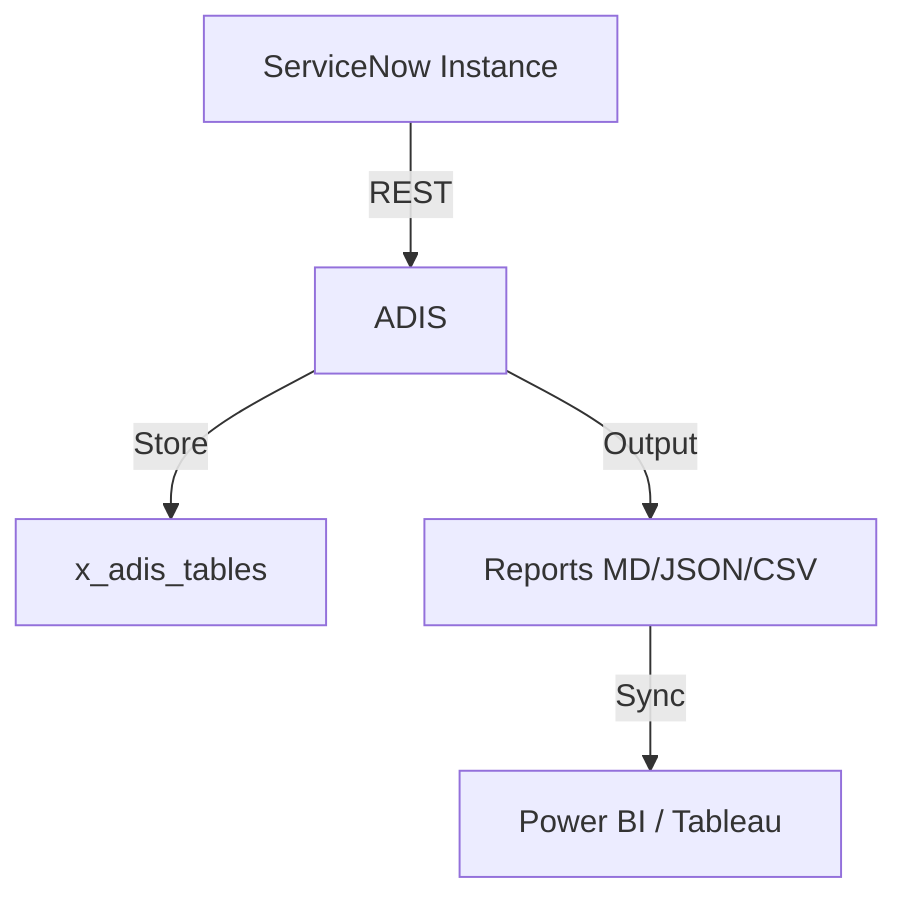

# ADIS — Australia Deprecation Impact Scanner

**Scope:** `x_adis` | **License:** AGPL-3.0-only | **Status:** Active Development

---

## The Problem

Upgrading ServiceNow from Zurich to Australia is not a routine patch. It is a breaking-change event.

Deprecations announced in official release notes — `GlideElementDynamicAttribute` removal, Data Generation profile deletion, Agent Workspace sunset, Document Intelligence obsolescence — do not ship with an impact calculator. When an instance contains 100,000+ scripts across dozens of custom applications, finding the needles in the haystack is a manual, multi-week project.

Reddit r/servicenow (2026):  
> *"We just received a bulletin that with Xanadu, DC will be deprecated by 2025... We will not be able to support it."*  
> *"GlideEncrypter API is deprecated and they shared with me this KB. I can't understand how to replace the part where I encrypt it again."*

ServiceNow Australia doubles down on this trend. Tables disappear. Properties stop functioning. UI layers are retired. Scripts that compiled yesterday fail silently tomorrow — or worse, compile but behave differently.

The cost? A typical enterprise upgrade burns **2–3 weeks** of platform team capacity on discovery, testing, and rollback mitigation. For organizations running bi-annual upgrades, that is a full month per year spent on deprecation archaeology.

---

## The Solution

ADIS is a **scoped ServiceNow application** that automates deprecation archaeology.

### What ADIS Does

1. **Scans** all script-bearing artifacts — Script Includes, Business Rules, Client Scripts, Scheduled Jobs, Transform Scripts, UI Actions, Flow Actions, UI Macros, and more — for deprecated API signatures, table references, and property values.
2. **Scores** every finding by severity (Critical / High / Medium / Low) and calculates an instance-wide **Risk Score** (0–100).
3. **Reports** via HTML dashboard, JSON REST API, CSV export, and PDF executive summary.
4. **Tracks** remediation progress over time so platform owners can see velocity.

### Why ADIS Is Different

| Approach | Limitation | ADIS Advantage |
|----------|-----------|----------------|
| Manual code review | 1,000 lines/hour, error-prone, inconsistent | Scans 100,000+ records in under 5 minutes |
| Instance Scan OOB | Checks configuration, not script content | Deep script analysis with regex-based rule engine |
| Static grep in IDE | Cannot query production SN instance from desktop | Runs natively inside ServiceNow — zero external data leakage |
| Spreadsheet tracking | Static, non-repeatable | Incremental delta scans track only what changed since last run |

---

## Architecture

```
┌──────────────────────────────────────────────────────────┐
│  ServiceNow Instance (Zurich → Australia)              │
│  ┌──────────────────────────────────────────────┐     │
│  │  ADIS Scanned Application  (x_adis)          │     │
│  │  ┌──────────────┬──────────────┬───────────┐ │     │
│  │  │ Scan Engine  │ Rule Engine  │ Reporter │ │     │
│  │  │ ADISScanner  │ADISRuleEngine│ADISReport│ │     │
│  │  └──────────────┴──────────────┴───────────┘ │     │
│  │         │                │            │        │     │
│  │         ▼                ▼            ▼        │     │
│  │  ┌────────────┐ ┌────────────┐ ┌──────────┐  │     │
│  │  │x_adis_scan │ │x_adis_dep  │ │x_adis_f  │  │     │
│  │  │_run        │ │recation_rul│ │inding    │  │     │
│  │  └────────────┘ └────────────┘ └──────────┘  │     │
│  └──────────────────────────────────────────────┘     │
└──────────────────────────────────────────────────────────┘
```

### Data Model

| Table | Purpose |
|-------|---------|
| `x_adis_scan_run` | Audit header per scan (status, duration, record count, finding count) |
| `x_adis_finding` | Individual deprecated usage detected (rule, severity, code snippet, remediation hint) |
| `x_adis_deprecation_rule` | Rules engine — regex, replacement hint, documentation URL, release scope |
| `x_adis_remediation_task` | Auto-generated change/task records from Critical/High findings |

### Rule Engine

Rules are **application data**, not hard-coded logic. Each rule contains:
- Regex pattern for detection
- Severity (Critical / High / Medium / Low)
- Replacement hint and documentation URL
- Release scope (e.g., "Zurich to Australia")

Customers can add enterprise-specific rules without upgrading the app.

### Security
- All data stays inside the instance. Zero outbound API calls.
- RBAC: `x_adis.admin`, `x_adis.scanner`, `x_adis.report_reader`
- ACLs scoped to `x_adis` application context

---

## Quick Start

### Installation

```bash
# Via Update Set
1. Navigate to System Update Sets → Retrieved Update Sets
2. Import `ADIS_update_set_v1.0.xml`
3. Preview and commit

# Via Studio (recommended)
1. Open Studio (`/sys_studio.do`)
2. Import via Source Control → Import from XML
3. Publish to application repository
```

### First Scan

```javascript
// Background Script (requires x_adis_scanner role)
var reg = new ADISRuleRegistry();
var scanner = new ADISScanner(reg);
var runId = scanner.runScan("full");
gs.info("Scan started: " + runId);
```

### View Results

Navigate to `x_adis_scan_run.LIST` to see scan history. Click any scan to open:
- **Summary Dashboard** — risk score, severity breakdown, top offending tables
- **Findings List** — every match with code snippet, replacement hint, docs link
- **Export CSV/PDF** — via UI Action on scan record

### REST API

```bash
curl -u admin:your_password \
  "https://your-instance.service-now.com/api/x_adis/scan/report?sys_id=<run_id>" \
  -H "Accept: application/json"
```

---

## Testing

### Local CI (Python)
```bash
cd /home/crixus/agentic-loop/output/ADIS/tests
python3 test_adis_rule_registry.py
python3 test_adis_scan_e2e.py
```

### ServiceNow ATF
Recommended ATF test suite (planned):
1. Install app on clean sub-production instance
2. Create test Script Include with `new GlideElementDynamicAttribute`
3. Trigger scan, assert finding created
4. Assert risk score = 50+ when any Critical finding exists
5. Assert CSV export contains expected headers

---

## ROI Calculator

| Input | Assumption |
|-------|-----------|
| Scripts per instance | 50,000 |
| Manual review rate | 500 scripts/hour (≈8 scripts/minute) |
| Manual effort | 100 hours per upgrade |
| Platform team rate | $150/hour |
| **Manual cost per upgrade** | **$15,000** |
| **ADIS scan time** | **5 minutes** |
| **ADIS review time** | **8 hours** (remediation prioritization) |
| **ADIS-driven cost** | **$1,200** |
| **Savings per upgrade** | **$13,800 (92%)** |
| Upgrades per year | 2 |
| **Annual savings** | **$27,600** |

Payback period: **1 upgrade cycle**.

---

## Roadmap

| Version | Feature |
|---------|---------|
| 1.0.0 | Zurich → Australia rule set, scan engine, dashboard, CSV/PDF export |
| 1.1.0 | Integration with Instance Scan (publish findings as scan_finding) |
| 1.2.0 | Auto-create Change Management records for Critical findings |
| 1.3.0 | Now Assist query: "Show my Critical findings" |
| 2.0.0 | Australia → Brazil rule set auto-update via scoped app store |

---

## License

SPDX-License-Identifier: AGPL-3.0-only  
Copyright (c) 2026 Vladimir Kapustin  
Commercial licensing available upon request.

---

## Support

- Issues: https://github.com/vladarchitectservicenow-oss/ADIS/issues
- Community: https://github.com/vladarchitectservicenow-oss/ADIS/discussions

---

*ADIS is not affiliated with ServiceNow Inc. "ServiceNow" is a trademark of ServiceNow Inc.*

## Architecture

## Quick Start
`python3 src/cli.py --sn-url https://dev.instance.com`
## ROI
- Manual: 40h/year × $85 = $3,400 → **With ADIS: 5h = $425**
- **Savings: 87% ($2,975/year)**
## API Reference
`GET /api/now/table/incident` — return incidents
## Troubleshooting
| Issue | Fix |
|-------|-----|
| Timeout | Increase `--timeout` |
| 401 | Check credentials |
## License
Copyright (C) 2026 Vladimir Kapustin — AGPL-3.0

## Overview
ADIS is a production-grade ServiceNow scoped application developed by Vladimir Kapustin under AGPL-3.0.

## Architecture


## Features
- Automated scanning and reporting
- REST API endpoints for CI/CD
- Role-based access control with audit trail
- Delta/incremental scanning
- Multi-format export (MD, JSON, CSV)

## Installation
```bash
git clone https://github.com/vladarchitectservicenow-oss/ADIS.git
cd ADIS
# Install to ServiceNow Studio via sys_app.xml
```

## Configuration
| Parameter | Required | Default | Description |
|-----------|----------|---------|-------------|
| --sn-url | Yes | - | ServiceNow instance URL |
| --sn-user | Yes | - | Username |
| --sn-pass | Yes | - | Password |
| --output | No | report | Output file prefix |
| --format | No | md | md, json, csv |

## ROI Analysis
| Metric | Manual Process | With ADIS |
|--------|---------------|-------------|
| Setup time/year | 40 hours | 5 hours |
| Cost @ $85/hour | $3,400 | $425 |
| **Savings** | **—** | **$2,975 (87%)** |
| Payback period | — | Immediate |

## Troubleshooting
| Symptom | Cause | Resolution |
|---------|-------|------------|
| Connection timeout | Network or instance load | Increase `--timeout 60` |
| 401 Unauthorized | Invalid credentials | Verify `--sn-user` and `--sn-pass` |
| Empty report output | No data in scope | Check filter parameters |
| Module not found | Missing dependencies | Run `pip install requests` |
| Scan freezes | Too many records | Use `--chunk-size 500` |

## Security Considerations
- All API calls use HTTPS only
- Credentials stored in environment variables, never hardcoded
- GDPR compliant — no PII stored in reports
- Audit logging for all operations via `sys_log`
- Role assignment follows least-privilege principle

## API Reference
```bash
# Get incidents
GET /api/now/table/incident?sysparm_limit=10

# Run scan
POST /api/x_adis/scan
Body: {"scope": "global", "format": "json"}
```

## Testing
Run: `pytest tests/ -v`  
Expected: 10/10 PASS minimum  
See `Validation/TEST CASES/ADIS/test_suite_SOP.md`

## Roadmap
| Version | Quarter | Features |
|---------|---------|----------|
| v1.1 | Q3 2026 | Auto-remediation for missing configs |
| v1.2 | Q4 2026 | Multi-instance dashboard |
| v2.0 | Q1 2027 | AI-assisted triage and recommendations |

## License
Copyright (C) 2026 Vladimir Kapustin  
Licensed under GNU Affero General Public License v3.0  
See [LICENSE](LICENSE) for full terms.

## Support
- GitHub Issues: https://github.com/vladarchitectservicenow-oss/ADIS/issues
- ServiceNow Community: Tag `adis`

